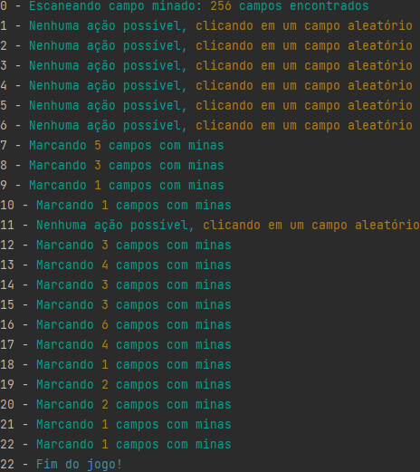

# Minesweeper Bot

Este bot foi inicialmente desenvolvido para jogar o jogo [Minesweeper Online](https://minesweeper.online/)
(Campo Minado), para praticar automação com o [OpenCV2](https://docs.opencv.org/4.x/d6/d00/tutorial_py_root.html) e 
[PyAutoGui](https://pyautogui.readthedocs.io/en/latest/)

Fui banido do site mesmo sem logar e jogar partidas ranqueadas, então o bot foi atualizado para jogar o jogo
[Minesweeper X](http://www.curtisbright.com/msx/)

O bot não é perfeito, realiza muitos cliques desnecessários além de não identificar padrões quando necessário.

OBS: Não utilize o bot para partidas ranqueadas! Seja honesto :)

<p align="center">

</p>

### Funcionamento:

A cada iteração as seguintes ações são tomadas:

* Captura da tela, uso do OpenCV para identificar o estado de cada célula do campo minado;
* Se for a primeira rodada ou nenhuma ação puder ser tomada, uma célula aleatória é escolhida para ser clicada;
* Se alguma célula puder ser resolvida (Ex: Célula com 3 e só tem 3 espaços disponíveis do lado dela), as minas são
sinalizadas com a bandeira;
* Se após a sinalização com bandeiras outras células se tornarem resolvidas, então estas células são clicadas para
eliminar as células não clicadas em torno delas;
* O ciclo se repete.

### Execução:

1. Abrir o [Minesweeper X](http://www.curtisbright.com/msx/), escolher uma dificuldade e deixar o jogo pronto
para iniciar;
2. Preparar o script ```main.py``` para rodar, escolhendo a dificuldade do jogo;
3. Executar o script ```main.py``` deixando a tela do jogo totalmente visível para o bot funcionar corretamente.

As ações do bot são resumidas no console, conforme a imagem:

<p align="center">

</p>
